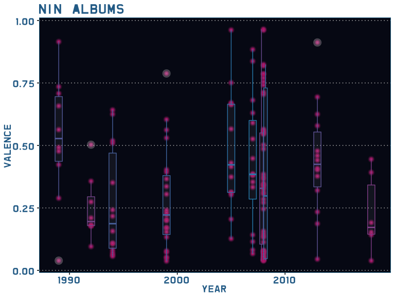
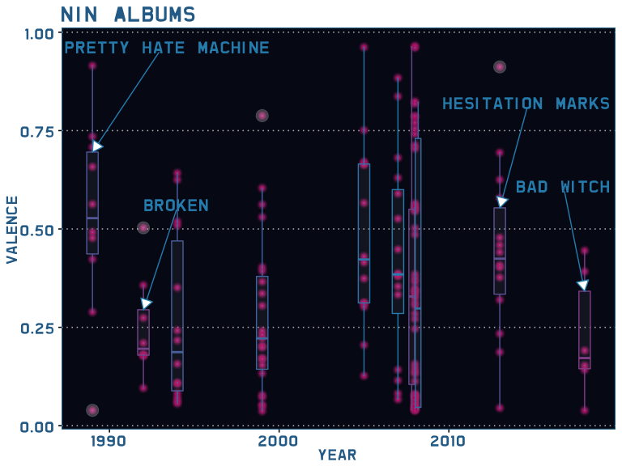
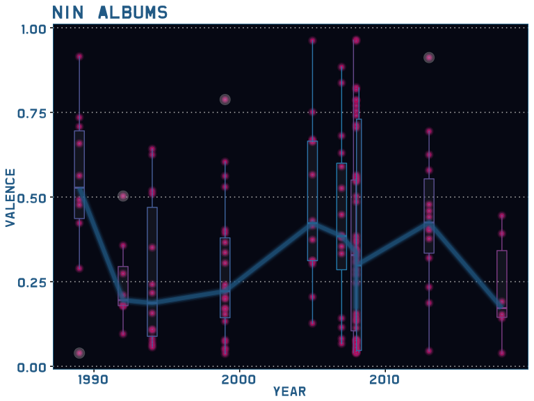
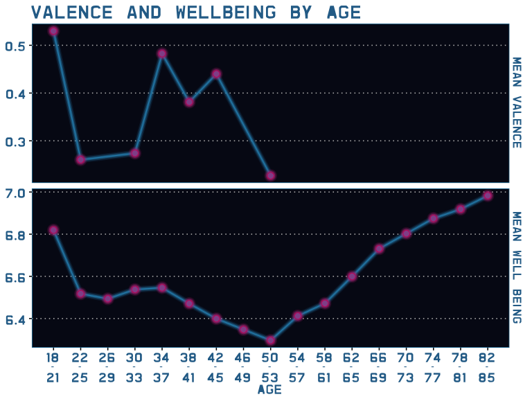

Downward into Happiness  

… a Nine Inch Nails stats story by Nissa Ferm 2019-07-03

 I remember
watching the music video *Head Like a Hole* on MTV and being blown away.
Instantly, Nine Inch Nails (NIN) was my favorite band and Trent Reznor
became my teenage crush 😍. Finally, in my twenties I went to see NIN
live. The opening act was Queens of the Stone Age. It rocked\! I dressed
in the black vinyl and leather pieces I had in my closet; along with my
coveted black knee high Doc Martens. My inner teenager squeed with
delight. I don’t listen to NIN as much as I used too, mainly because my
musical tastes have changed and expanded since then. I love listening to
jazz and swing while cooking dinner, but my teenage self would have
sqwinched her face in disgust 😝. I just have to remember that we don’t
owe anything to our past selves.

I had Pretty Hate Machine on tape. I wore that poor tape out on my
yellow Sony Sports Walkman with the Super Bass button. The album is so
seared in my mind; if one of the songs from Pretty Hate Machine comes up
in a play list my mind is waiting for the next track. When it doesn’t,
I’m a little dissapointed. Pretty Hate Machine was my jam and made me
feel pumped. Music has a way of giving voice to our feelings and has an
influence on them. There is a music metric which is reflective of how a
song makes us feel, it is called valence. From my science background
valence is a term I remember from chemistry and physics. But, in the
musical world of Spotify it has nothing to do with orbitals or
electrons. This is how Spotify defines valence,

*“A measure from 0.0 to 1.0 describing the musical positiveness conveyed
by a track. Tracks with high valence sound more positive (e.g. happy,
cheerful, euphoric), while tracks with low valence sound more negative
(e.g. sad, depressed, angry).”*

The definition and some explanation into its creation can be found in
the [Spotify
documentation](https://developer.spotify.com/documentation/web-api/reference/tracks/get-several-audio-features/).
Considering how pumped that album made me feel and the shifts in the
subsequent albums, did the valence of Nine Inch Nails albums change over
time? Let’s find out. 

… into the void

 In order to answer
my question I used the R package
[spotifyr](https://github.com/charlie86/spotifyr), to retrieve the data
from Spotify. Check the link if you want to know more about the spotifyr
package and how set up a dev account with Spotify. Also, if you want to
see all the R code for this document and analysis visit my [Github
repo](https://github.com/Copepoda/NIN_album_project). I limited the
analysis to the nine standard studio albums and Broken. The [ten
albums](https://en.wikipedia.org/wiki/Nine_Inch_Nails_discography#Studio_albums)
are Pretty Hate Machine, Broken, The Downward Spiral, The Fragile, With
Teeth, Year Zero, Ghosts I-IV, The Slip, Hesitation Marks, and Bad
Witch. With data in hand, I needed to do a little cleaning. I found some
instances of duplication in the data-set. The duplication seemed to stem
from significant digit rounding which created duplicate entries for some
of the calculated metrics. I removed the duplicates by using album\_name
and track\_name. I didn’t use track number as this would filter out
tracks from a double album.

For this type of data a box plot is appropriate. Box plots allow us to
visualize the relative difference in distribution of valence between the
albums. The bar in the middle of the box represents the
[median](https://www.mathsisfun.com/median.html) valence of the album,
while the upper and lower bounds of the box correspond to the 25th and
75th percentiles. This means 50% of the data fall within the box and
data that are beyond the whiskers are outliers. I’ve also added the
individual track valence values for the albums, so each point on the
plot represents the valence of a track from an album.

I used the color pallet from the Pretty Hate Machine [cover
art](https://www.nin.wiki/images/4/40/PHMvinyl.jpg) and I extracted the
major hex colors using [color
explorer](http://www.colorexplorer.com/imageimport.aspx). In keeping
with the theme I made sure to have NIN fonts as well. I found some [NIN
fonts](https://www.nindestruct.com/fonts.html) and installed the fonts
using the [extrafont
package](https://cran.r-project.org/web/packages/extrafont/README.html).
In order to create the blur I want to give a shout-out to the cool R
package
[ggecho](https://coolbutuseless.github.io/2019/03/22/ggecho-an-experimental-ggplot-stat-for-blurring-elements/)
for helping to give the plots a little late 80’s - early 90’s flare.

So, enough about colors and fonts. Let’s check out the plot. There do
appear to be differences in valence between albums. Most notably the
first two, Pretty Hate Machine and Broken. How do we know if those
differences are real? 

… down in it

<table class="table" style="width: auto !important; float: right; margin-left: 10px;">

<thead>

<tr>

<th style="border-bottom:hidden; padding-bottom:0; padding-left:3px;padding-right:3px;text-align: left; " colspan="3">

Table One:

</th>

</tr>

<tr>

<th style="border-bottom:hidden" colspan="1">

</th>

<th style="border-bottom:hidden; padding-bottom:0; padding-left:3px;padding-right:3px;text-align: left; " colspan="2">

Shapiro-Wilk Normality Test

</th>

</tr>

<tr>

<th style="text-align:left;">

Album

</th>

<th style="text-align:right;">

statistic

</th>

<th style="text-align:left;">

p.value

</th>

</tr>

</thead>

<tbody>

<tr>

<td style="text-align:left;">

Bad Witch

</td>

<td style="text-align:right;">

0.902

</td>

<td style="text-align:left;">

0.388

</td>

</tr>

<tr>

<td style="text-align:left;">

Broken

</td>

<td style="text-align:right;">

0.888

</td>

<td style="text-align:left;">

0.225

</td>

</tr>

<tr>

<td style="text-align:left;">

Ghosts I-IV

</td>

<td style="text-align:right;">

0.908

</td>

<td style="text-align:left;">

0.003

</td>

</tr>

<tr>

<td style="text-align:left;">

Hesitation Marks

</td>

<td style="text-align:right;">

0.981

</td>

<td style="text-align:left;">

0.981

</td>

</tr>

<tr>

<td style="text-align:left;">

Pretty Hate Machine

</td>

<td style="text-align:right;">

0.976

</td>

<td style="text-align:left;">

0.939

</td>

</tr>

<tr>

<td style="text-align:left;">

The Downward Spiral

</td>

<td style="text-align:right;">

0.839

</td>

<td style="text-align:left;">

0.016

</td>

</tr>

<tr>

<td style="text-align:left;">

The Fragile

</td>

<td style="text-align:right;">

0.913

</td>

<td style="text-align:left;">

0.046

</td>

</tr>

<tr>

<td style="text-align:left;">

The Slip

</td>

<td style="text-align:right;">

0.823

</td>

<td style="text-align:left;">

0.028

</td>

</tr>

<tr>

<td style="text-align:left;">

With Teeth

</td>

<td style="text-align:right;">

0.956

</td>

<td style="text-align:left;">

0.662

</td>

</tr>

<tr>

<td style="text-align:left;">

Year Zero

</td>

<td style="text-align:right;">

0.948

</td>

<td style="text-align:left;">

0.461

</td>

</tr>

</tbody>

</table>

 To determine if
the valence was different between albums, first I needed to run a few
tests on the data. First I tested for normality. I did this using the
Shapiro-Wilk Normality test. For a Shapiro-Wilk test, if a p-value \>
0.05 it implies that the distribution of the valence data of each album
are not significantly different from a normal distribution. In other
words, I can assume the normality. Table One shows that a few of the
albums do have a non-normal distribution. The second is to test for
homogeneity of the variances. Since the data already broke the normality
assumption I used the Levene test instead of the Bartlett’s. The
variances are similar according to the Levene test as shown in Table
Two. 

… kinda I want to

 Now, I have the
information I need to see if the valences of the albums are different
from each other? Based on the output from the first two tables I went
with a non-parametric test. As an aside, you could transform the data to
make them normal and use a parametric test. So, I decided to use the
non-parametric Kruskal-Wallis test, which tests if the medians of the
valence among the albums are equal. The output is in Table Three. The
p-value from the Kruskal-Wallis test indicates that we should have a
further look, that the valence of some of the albums might be different
from each other. In the box-plot there are a couple of albums which
stand out as being different from each other: Pretty Hate Machine,
Broken, Hesitation Marks, and Bad Witch. Since these four albums all
have normal distributions, I went ahead and used the simple t.test. I
could have used the Wilcox but I wanted to keep it simple. 

<table class="table" style="width: auto !important; float: right; margin-left: 10px;">

<thead>

<tr>

<th style="border-bottom:hidden; padding-bottom:0; padding-left:3px;padding-right:3px;text-align: left; " colspan="3">

Table Three:

</th>

</tr>

<tr>

<th style="border-bottom:hidden; padding-bottom:0; padding-left:3px;padding-right:3px;text-align: left; " colspan="3">

Kruskal-Wallis rank sum test

</th>

</tr>

<tr>

<th style="text-align:right;">

parameter

</th>

<th style="text-align:right;">

statistic

</th>

<th style="text-align:left;">

p.value

</th>

</tr>

</thead>

<tbody>

<tr>

<td style="text-align:right;">

9

</td>

<td style="text-align:right;">

17.767

</td>

<td style="text-align:left;">

0.038

</td>

</tr>

</tbody>

</table>

<table class="table" style="width: auto !important; float: right; margin-left: 10px;">

<thead>

<tr>

<th style="border-bottom:hidden; padding-bottom:0; padding-left:3px;padding-right:3px;text-align: left; " colspan="3">

Table Two:

</th>

</tr>

<tr>

<th style="border-bottom:hidden; padding-bottom:0; padding-left:3px;padding-right:3px;text-align: left; " colspan="3">

Levene’s Test for Homogeneity of Variance

</th>

</tr>

<tr>

<th style="text-align:right;">

df

</th>

<th style="text-align:right;">

statistic

</th>

<th style="text-align:right;">

p.value

</th>

</tr>

</thead>

<tbody>

<tr>

<td style="text-align:right;">

9

</td>

<td style="text-align:right;">

1.534

</td>

<td style="text-align:right;">

0.141

</td>

</tr>

</tbody>

</table>

<table class="table" style="margin-left: auto; margin-right: auto;">

<thead>

<tr>

<th style="border-bottom:hidden" colspan="1">

</th>

<th style="border-bottom:hidden; padding-bottom:0; padding-left:3px;padding-right:3px;text-align: left; " colspan="4">

Welch Two Sample t-test

</th>

</tr>

<tr>

<th style="text-align:left;">

Albums

</th>

<th style="text-align:right;">

Mean album 1

</th>

<th style="text-align:right;">

Mean album 2

</th>

<th style="text-align:right;">

statistic

</th>

<th style="text-align:left;">

p.value

</th>

</tr>

</thead>

<tbody>

<tr>

<td style="text-align:left;">

Pretty Hate Machine / Broken

</td>

<td style="text-align:right;">

0.53

</td>

<td style="text-align:right;">

0.25

</td>

<td style="text-align:right;">

3.115

</td>

<td style="text-align:left;">

0.008

</td>

</tr>

<tr>

<td style="text-align:left;">

Pretty Hate Machine / Bad Witch

</td>

<td style="text-align:right;">

0.53

</td>

<td style="text-align:right;">

0.23

</td>

<td style="text-align:right;">

2.986

</td>

<td style="text-align:left;">

0.01

</td>

</tr>

<tr>

<td style="text-align:left;">

Broken / Hesitation Marks

</td>

<td style="text-align:right;">

0.25

</td>

<td style="text-align:right;">

0.44

</td>

<td style="text-align:right;">

\-2.596

</td>

<td style="text-align:left;">

0.017

</td>

</tr>

<tr>

<td style="text-align:left;">

Hesitation Marks / Bad Witch

</td>

<td style="text-align:right;">

0.44

</td>

<td style="text-align:right;">

0.23

</td>

<td style="text-align:right;">

2.448

</td>

<td style="text-align:left;">

0.029

</td>

</tr>

<tr>

<td style="text-align:left;">

Pretty Hate Machine / Hesitation Marks

</td>

<td style="text-align:right;">

0.53

</td>

<td style="text-align:right;">

0.44

</td>

<td style="text-align:right;">

0.917

</td>

<td style="text-align:left;">

0.371

</td>

</tr>

<tr>

<td style="text-align:left;">

Broken / Bad Witch

</td>

<td style="text-align:right;">

0.25

</td>

<td style="text-align:right;">

0.23

</td>

<td style="text-align:right;">

0.257

</td>

<td style="text-align:left;">

0.803

</td>

</tr>

</tbody>

</table>

 So, there are
differences in valence between some of the NIN albums across time. The
stand out really is between the first album, Pretty Hate Machine, and
the second Broken. I wouldn’t hazard a guess as to why the valence
changed so much, I’m sure there are amazing people out there who have
their own hypotheses\! There was something about the shape of the
medians across time that reminded me of an article I read a while ago.
It might be a stretch but this plot reminded me of the [happiness/ well
being by age studies](https://www.pnas.org/content/107/22/9985). The
gist is that reported well being changes as we age and that there is a
general “U” shape pattern to the data. The dip in the “U” ,the most
negative well being scores, is about 50 years of age.

… that’s what I get

  I didn’t
have access to the original data, so I used the
[WebPlotDigitizer](https://automeris.io/WebPlotDigitizer/) to extract
the plot data points from the research paper; then download the .csv
file and read it into R. In the original study the respondents are
placed into four year time bins. To match the happiness study data I
added Trent Reznor’s age at each album release and subtracted two years
to estimate the age of at which he was working on the album. Two years
seemed like a reasonable estimate. Then I binned the valence data by the
same time bins as the happiness study and calculated the mean. It is an
interesting, if suggestive, plot. Maybe they do track each other just a
wee bit? 

… underneath it all

 Has NIN, reached
the bottom of the happiness curve? Will we see an upward tick in valence
in the future? Will they make us feel more happy? Regardless of the
outcome, I look forward to future albums. I know they will at least make
me happy.

Don’t forget to check out my [Git Hub](https://github.com/Copepoda/)
repo and my [website](https://www.nissaferm.com/). This is a first
attempt at a data science blog post. I hope you enjoyed it and thanks
for reading\!

This was written in [Rmarkdown](https://rmarkdown.rstudio.com/) 💜. And
made easier with the [tidyverse](https://www.tidyverse.org/) and these R
packages:
[broom](https://cran.r-project.org/web/packages/broom/index.html),
[car](https://cran.r-project.org/web/packages/car/index.html),
[emo](https://github.com/hadley/emo),
[extrafont](https://cran.r-project.org/web/packages/extrafont/README.html),
[ggecho](https://coolbutuseless.github.io/2019/03/22/ggecho-an-experimental-ggplot-stat-for-blurring-elements/),
[ggrepel](https://cran.r-project.org/web/packages/ggrepel/index.html),
[ggthemes](https://cran.r-project.org/web/packages/ggthemes/index.html),
[kableExtra](https://cran.r-project.org/web/packages/kableExtra/index.html),
[lubridate](https://cran.r-project.org/web/packages/lubridate/index.html),
[spotifyr](https://cran.r-project.org/web/packages/spotifyr/index.html),
stats, and
[zoo](https://cran.r-project.org/web/packages/zoo/index.html). To the
creators and maintainers of the R open source world, I appreciate all
the work you do.

